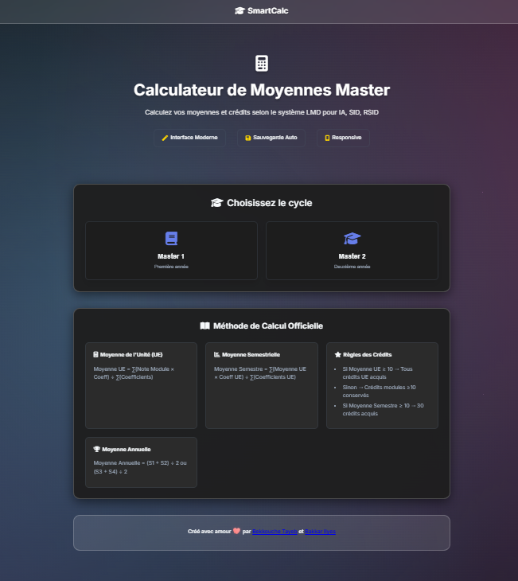
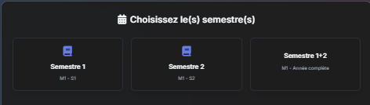
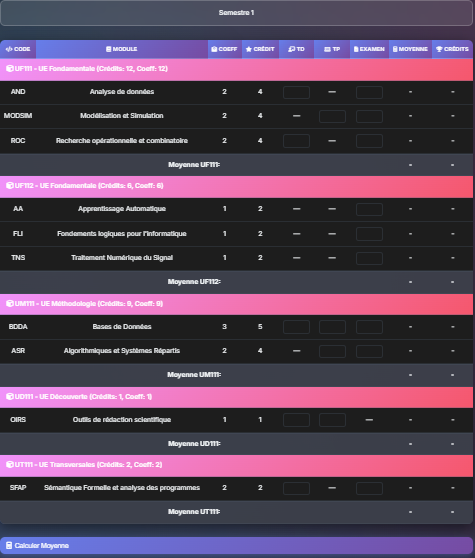
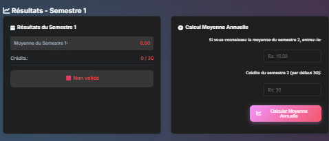

# SmartCalc


## Description
SmartCalc est une application web interactive conçue pour aider les étudiants à calculer et gérer leurs moyennes académiques (modules, unités, semestres, moyenne annuelle) avec la possibilité d'exporter les résultats au format PDF.

## Fonctionnalités principales

*   **Sélection du cycle, spécialité et semestre :** Permet une personnalisation facile pour s'adapter aux différents cursus académiques.
*   **Affichage dynamique des modules avec crédits et coefficients :** Visualisation claire des informations essentielles pour chaque module.
*   **Calcul automatique des moyennes :** Calcule instantanément les moyennes des modules, unités, semestres et la moyenne annuelle.
*   **Mode sombre/clair :** Offre une expérience utilisateur agréable et adaptable à l'environnement.
*   **Réinitialisation des données et notifications interactives :** Facilite la gestion des données et informe l'utilisateur des actions importantes.
*   **Export en PDF :** Génère des rapports PDF professionnels avec un style A4 et le logo de la faculté, idéal pour l'impression ou le partage.

## Technologies utilisées

*   HTML
*   CSS
*   JavaScript

## Installation et exécution

Pour installer et exécuter SmartCalc localement, suivez ces étapes :

1.  **Cloner le dépôt :**
    ```bash
    git clone https://github.com/votre-utilisateur/SmartCalc.git
    ```
2.  **Naviguer vers le répertoire du projet :**
    ```bash
    cd SmartCalc
    ```
3.  **Ouvrir dans le navigateur :**
    Ouvrez le fichier `index.html` directement dans votre navigateur web préféré.

## Structure des fichiers

Voici la structure principale des fichiers du projet :

```
SmartCalc/
├── index.html          # Structure principale de l'application
├── app.js              # Logique JavaScript de l'application
├── style.css           # Styles CSS de l'application
├── autres fichers      # Contient les images, pdfs, etc.
└── README.md           # Ce fichier README
```

## Captures d’écran

*   
*   
*   
*   
*   
*   
*   

## Améliorations futures

*   Ajout complet des spécialités Licence pour couvrir tout le système LMD Informatique (Licence, Master, Doctorat).
*   Intégration des spécialités Ingénieur Informatique.
*   Ajout d’un espace Drives et d’outils pour que le site devienne une plateforme complète pour étudiants.
*   Ajout d’IA pour recommandations personnalisées.

## Auteur & Licence

**Auteur :** BEKKOUCHE Tayeb
             BAKKAR Ilyes

Ce projet est sous licence [MIT License](LICENSE).
